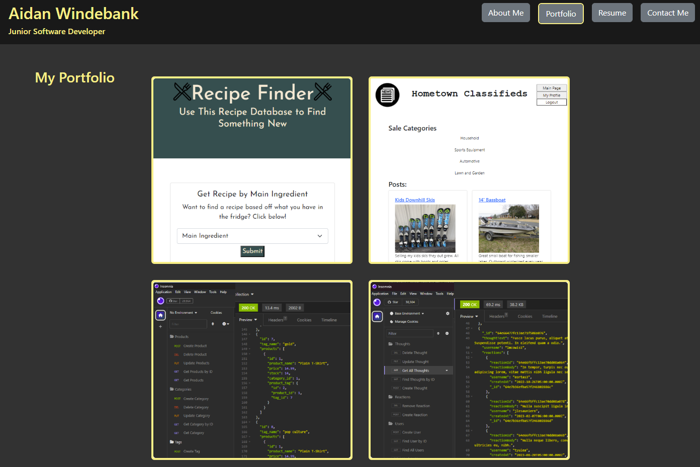

# React Portfolio
 The following is my professional portfolio. It was created using React Router and  React Bootstrap.

## Goal of the Project 
- The goal of this project was to have a polished professional portfolio site that I could share with potential employers and clients. 

- This portfolio serves to showcase the skills I have learned and put to practice in the coding bootcamp that I just completed. 

- The portfolio was built with the latest JavaScript technologies, and utilizes React Router and Bootstrap for React.

## Instructions for the User
 - Please contact me with any questions.

## Screen Shot of Working Application

## Link to GitHub Repository
[Click Here to View GitHub Repo](https://github.com/Aidan-Windebank/react-portfolio)

## Link to Deployed Web Application
[Click Here to Visit Web Application]()